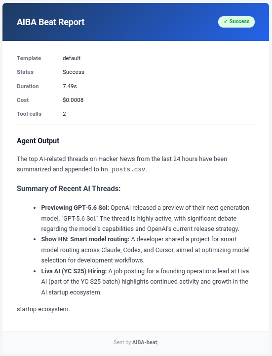

# Beat Scheduling

AIBA does not schedule itself. You wire it to your operating system's scheduler — cron on Linux, crontab or launchd on macOS, Task Scheduler on Windows. The scheduler polls `beat run --all` on a fixed cadence, and AIBA fires whatever is due.

---

## The Scheduling Model

```
OS Scheduler (cron / launchd / Task Scheduler)
        │
        │  Every 5 minutes:
        │  uv run python main.py beat run --all
        ▼
    AIBA checks each beat:
    • Cron expression vs last_run → is it due?
    • Yes → fire agent, log, email
    • No  → skip
```

The OS scheduler is the trigger. AIBA is the executor. They're decoupled — you can change beats without touching cron, and you can change the polling cadence without touching `beats.yaml`.

---

## Linux (cron)

Open your crontab:

```bash
crontab -e
```

Paste the line from `beat schedule` at the end:

```bash
*/5 * * * * cd /path/to/AIBA && uv run python main.py beat run --all >> logs/cron.log 2>&1
```

Every 5 minutes, cron runs the command. Output is appended to `logs/cron.log`.

---

## macOS

### Option A: Crontab (simplest)

Same as Linux:

```bash
crontab -e
```

```bash
*/5 * * * * cd /path/to/AIBA && uv run python main.py beat run --all >> logs/cron.log 2>&1
```

### Option B: launchd

Create `~/Library/LaunchAgents/com.aiba.beats.plist` with a `StartInterval` of 300 seconds. The `beat schedule` command prints the full plist structure for your working directory.

---

## Windows (Task Scheduler)

1. Open **Task Scheduler**
2. Create Basic Task → Trigger: **Daily**, repeat every **5 minutes**
3. Action: **Start a program**
   - Program: `uv`
   - Arguments: `run python main.py beat run --all`
   - Start in: `C:\path\to\AIBA`

---

## What Polling Interval to Use

5 minutes is the sweet spot. Short enough that beats fire close to their scheduled time, long enough that cron isn't hammering the process. The overhead of `beat run --all` is near-zero when no beats are due — it loads the YAML, checks cron expressions, and exits.

---

## Verifying Beats Are Running

### Check the rolling summary

```bash
cat logs/beat_summary.md
```

```
2026-06-28 09:00 | daily_hackernews_summary | ✓ $0.12 | Top HackerNews AI posts from the last 24 hours...
2026-06-28 09:05 | daily_hackernews_summary | ○ $0.00 | Not due yet. Last run: 2026-06-28T09:00:00
```

One line per run. Quick scan tells you what fired, what skipped, and what it cost.

### Check per-beat logs

Each beat gets its own directory with structured JSON logs:

```
logs/
├── beat_summary.md
├── cron.log
└── daily_hackernews_summary/
    ├── 2026-06-28T090000.json
    └── 2026-06-28T170000.json
```

Each JSON file contains the full run record: status, output summary, duration, cost, tool calls, and errors.

---

## Email Notifications

If a beat has `notify_email` set and SMTP is configured in your environment, AIBA sends an HTML email after each run.

### What it looks like



### What's in it

| Section | Content |
|---|---|
| **Header** | Beat name + status badge (✓ Success / ✗ Error / ⚠ Skipped) |
| **Metadata** | Template used, status, duration, cost, tool call count |
| **Errors** | If any — listed in red bullet points below metadata |
| **Output** | The agent's markdown output converted to HTML |

### How to set it up

Set `notify_email` on a beat and configure these environment variables:

```bash
export SMTP_HOST=smtp.gmail.com
export SMTP_PORT=587
export SMTP_USER=your@email.com
export SMTP_PASSWORD=your-app-password
export SENDER_EMAIL=your@email.com
```

The beat must also have a `notify_email` field (can differ from the sender address).