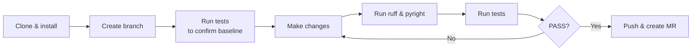

# Contributing to AIBA

First off — thank you for considering a contribution. AIBA aims to be a high-quality,
production-grade autonomous agent, and every improvement counts.

---

## Before You Start

Read the [**Developer Guidelines & Code Rules**](https://github.com/hamza-mughal1/AIBA/blob/main/rules.md)
(`rules.md` in the project root). This is the single source of truth for how the
codebase is built and maintained. The highlights:

| Principle | What it means |
|---|---|
| **Product-Grade Quality** | Every line should feel production-ready. No shortcuts. |
| **Simplicity > Cleverness** | Prefer clear, explicit logic over dense one-liners. |
| **Single Responsibility** | One function, one job. |
| **Smart Abstraction** | Don't abstract unless the logic is shared by multiple callers. |
| **Minimalist Footprint** | Write what's needed — no speculative features. |
| **Zero-Bug Tolerance** | Think through edge cases before you write code. |
| **Concise Documentation** | Comment the *why*, not the *what*. Keep it brief. |
| **Use UV** | Build, test, lint, and type-check through `uv run`.

---

## Prerequisites

| Tool | Version | Why |
|---|---|---|
| **Python** | 3.13+ | The runtime. |
| **[uv](https://docs.astral.sh/uv/)** | latest | Package & environment manager. |
| **Node.js** | 18+ | Required by Playwright MCP. |
| **npm** | 8+ | Ships with Node. |

---

## Setup for Development

### 1. Clone & install

```bash
git clone https://github.com/hamza-mughal1/AIBA
cd AIBA
uv sync --dev
```

`uv sync --dev` installs both runtime and development dependencies (pytest,
ruff, pyright, etc.).

### 2. Install the browser

```bash
uv run playwright install chromium
```

### 3. Create your environment file

```bash
cp .env.example .env
```

Open `.env` and set the one required field:

```ini
GEMINI_API_KEY=AIza...your-key-here
```

??? tip "Do I need a Gemini key to contribute?"
    If you're only modifying non-agent code (tests, docs, configuration, CI),
    you can skip the API key. Tests that call the LLM use `TestModel` mocks
    and never make real API requests.

---

## The Contribution Workflow



### 1. Create a branch

```bash
git checkout -b feat/my-feature
```

Use a descriptive prefix:

| Prefix | When |
|---|---|
| `feat/` | New feature |
| `fix/` | Bug fix |
| `docs/` | Documentation |
| `refactor/` | Code restructuring |
| `test/` | Adding or improving tests |
| `chore/` | Tooling, CI, dependencies |

### 2. Confirm the baseline

Before making any changes, verify everything passes:

```bash
uv run pytest tests/unit/ -q
# Expected: all tests passed!

uv run ruff check
# Expected: All checks passed!

uv run pyright
# Expected: 0 errors, 0 warnings
```

### 3. Make your changes

Follow the rules in `rules.md` — especially:

- **Single Responsibility:** Don't stuff multiple concerns into one function.
- **Minimalist Footprint:** Add exactly what the feature needs, nothing more.
- **Explicit Logic:** Write code that's easy to scan and understand.
- **No Truncation:** When editing files, provide complete contents — no `// ...`
  placeholders.

If you're adding or modifying any `pydantic-ai`, `playwright`, or `google-genai`
logic, consult the latest official documentation for those libraries to avoid
deprecated patterns.

### 4. Run quality checks again

```bash
# Full test suite with coverage
uv run pytest tests/unit/ --cov=src --cov-report=term-missing -q

# Linting
uv run ruff check

# Type checking
uv run pyright
```

The project maintains **100% coverage** and **zero lint/type errors**.
Your contribution should preserve both.

### 5. Push and create a Merge Request

```bash
git push -u origin feat/my-feature
```

Then open a Merge Request on GitHub. In the description, include:

- **What** the change does.
- **Why** it's needed.
- **How** you verified it (tests run, lint clean, type-check passed).

---

## Code Review Expectations

All contributions go through code review. Reviewers will check for:

- Correctness and edge-case coverage.
- Adherence to `rules.md` principles.
- Test coverage (new code should be tested).
- No regressions (existing tests must pass).
- Clean lint and type-check results.

Don't take feedback personally — the goal is a shared codebase we're all proud of.

---

## Need Help?

Open a [Discussion](https://github.com/hamza-mughal1/AIBA/discussions) or an
[Issue](https://github.com/hamza-mughal1/AIBA/issues). We're happy to help you
get started.
