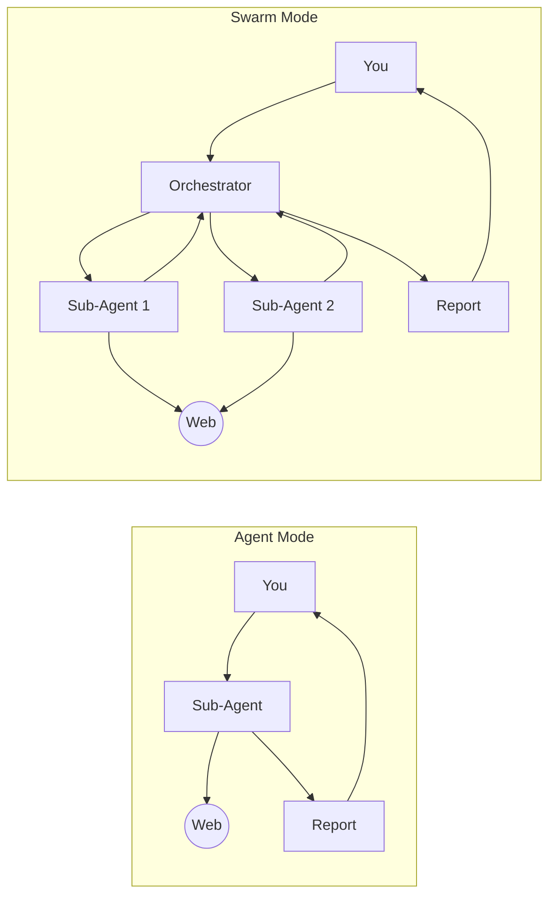

# Modes

A mode is the execution architecture AIBA uses to pursue your goal. You pick it at launch — it determines *how* the goal gets done, not *what* the goal is. Same prompt, same template, same effort. Two fundamentally different engines underneath.

---

### There are two execution modes in AIBA [Agent Mode](#agent-mode) and [Swarm Mode](#swarm-mode) 

---

## Agent Mode

One sub-agent. Full internet access. It plans, searches, browses, and reports — all by the same agent.

Think of it as a focused researcher sitting down at a machine. It can search the web, fetch pages, open a browser for dynamic content, read screenshots, and filter through results. It works linearly — one investigation step at a time — and delivers a single synthesized answer.

**Best for:** Focused, single-domain tasks. Researching one company. Answering one question. QA testing one flow. Anything where the scope fits in one brain.

---

## Swarm Mode

Two layers: an **Orchestrator** and a fleet of parallel **Sub-Agents**.

The Orchestrator never touches the web. Its job is architecture: break the goal into atomic tasks, dispatch them in parallel waves, ingest the results, detect new leads, and synthesize everything into a final report. It runs a continuous loop:

1. **Discover & Plan** — decompose the objective into discrete, independent tasks
2. **Dispatch** — fire sub-agents in parallel, each with a specific target
3. **Ingest & Pivot** — analyze returned payloads, mark tasks complete, detect unmapped leads
4. **Synthesize** — unify findings and deliver the structured report

Sub-agents in swarm mode are pure web workers. Each gets a specific target and runs independently. They search, fetch, browse, screenshot, and filter — then report back. The Orchestrator decides whether to launch another wave or synthesize.

If a sub-agent discovers something unexpected — a new domain, a person's handle, a hidden API endpoint — the Orchestrator spawns new tasks for the next wave. This is **pivot detection**: the swarm doesn't just execute a static plan, it adapts as it learns.

**Best for:** Large-scale, multi-domain research. Competitive landscape analysis. Multi-hop investigations where one discovery opens three new leads. Anything where the scope exceeds what one brain can track.

---

## Side by Side

| Dimension | Agent | Swarm |
|---|---|---|
| **Architecture** | Single sub-agent | Orchestrator + parallel sub-agents |
| **Execution** | Linear — one step at a time | Parallel waves — multiple targets at once |
| **Planning** | Implicit — the agent decides as it goes | Explicit — the Orchestrator maintains a task plan |
| **Adaptation** | Natural language pivots within one thread | Structured pivot detection spawns new tasks |
| **Best for** | Focused, single-domain work | Broad, multi-domain research |

---

## How to Choose

Pick **Agent** when:

* Your goal targets one domain, one site, or one question
* You're exploring or QA testing — linear flow works better
* You're running a template like `default` for a quick task

Pick **Swarm** when:

* Your goal spans multiple domains, companies, or platforms
* You need exhaustive coverage — not one answer, but all answers
* The research has branches — each finding might open new leads
* You're running templates like `job_search`, `osint`, or a custom template built for breadth

**Rule of thumb:** If you can state your goal in one sentence without "and" or "also", start with Agent. If you hear yourself saying "find X, then for each X find Y, then compare all the Ys" — that's a Swarm.

---

## Architecture

